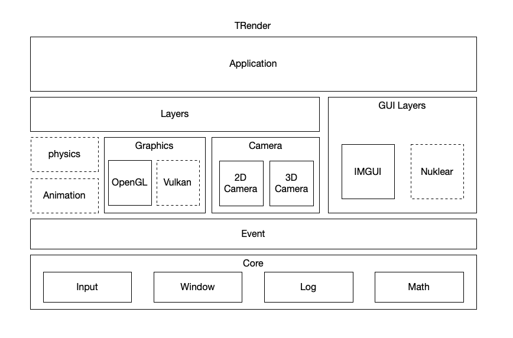

# TRender

I don't know whether I can finish it, but I just want to make a toy render engine for myself. And learn some new things anyway.

The tutorial from [TheCherno](https://github.com/TheCherno/Hazel) for making a game engine helps a lot.

- Start and Run

```bash
    chmod +x ./autorun.sh
    ./autorun.sh
```

## TRender Architechure


